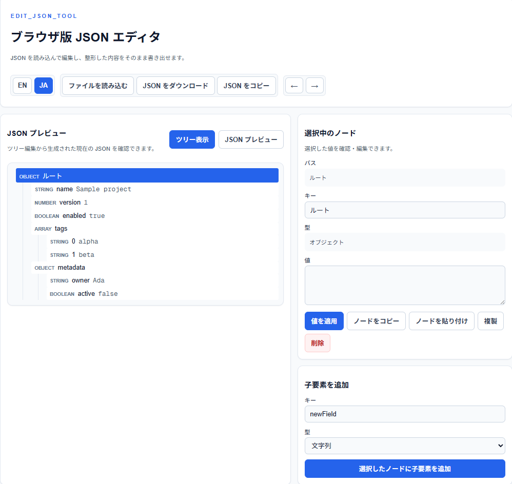

# edit_json_tool

[English README](README.md)

JSON ファイルをブラウザ上で読み込み、ツリー UI で確認・編集・書き出しできる JSON エディタです。



## デモ

https://rakima.github.io/edit_json_tool/

## 主な機能

- ローカルの `.json` ファイルをファイル選択またはドラッグ & ドロップで読み込み
- 生テキストではなくツリー表示を中心に JSON を編集
- 選択中ノードのキー、型、値を確認・編集
- object / array への子要素追加
- ノードの複製、削除、コピー、貼り付け
- 同じ親を持つ要素のマウスドラッグ並べ替え
- Undo / Redo
- 整形済み JSON の読み取り専用プレビュー
- 編集結果の JSON ダウンロード、クリップボードコピー
- English / Japanese の UI 切り替え

## 使い方

1. ブラウザでアプリを開きます。
2. `ファイルを読み込む` から JSON ファイルを選ぶか、`.json` ファイルをエディタ領域へドロップします。
3. `ツリー表示` でノードを選択します。
4. 右側の `選択中のノード` パネルでキーや値を編集します。
5. 必要に応じて、子要素追加、複製、削除、コピー/貼り付け、ドラッグ並べ替えを行います。
6. `JSON プレビュー` で結果を確認します。
7. `JSON をダウンロード` または `JSON をコピー` で書き出します。

## キーボードショートカット

| ショートカット | 操作 |
| --- | --- |
| `Ctrl+N` | 空の JSON object を新規作成 |
| `Ctrl+O` | ファイル選択を開く |
| `Ctrl+S` | 現在の JSON をダウンロード |
| `Ctrl+C` | 入力欄にフォーカスがない時、選択中ノードをコピー |
| `Ctrl+V` | 入力欄にフォーカスがない時、コピー済みノードを貼り付け |
| `Ctrl+Z` | 元に戻す |
| `Ctrl+Y` | やり直し |
| `Delete` | 選択中ノードを削除 |
| `F2` | 選択中ノードの値編集欄へフォーカス |

## 開発

```bash
npm install
npm run dev
```

起動後、http://localhost:3000 を開きます。

## コマンド

```bash
npm run dev
npm run build
npm run start
npm run lint
npx tsc --noEmit
npm run test:e2e
```

## テスト

ブラウザ回帰テストには Playwright を使っています。値編集、キー空欄チェック、キー変更の Undo、ドラッグ並べ替えを確認します。

```bash
npm run test:e2e
```

Playwright のブラウザが未インストールの場合:

```bash
npx playwright install chromium
```

## デスクトップ版との関係

`edit_json_tool_desktop` はデスクトップ版の参照実装です。このブラウザ版は同じツリー編集の考え方を引き継ぎつつ、ブラウザ内で完結するクライアントサイドのワークフローにしています。
