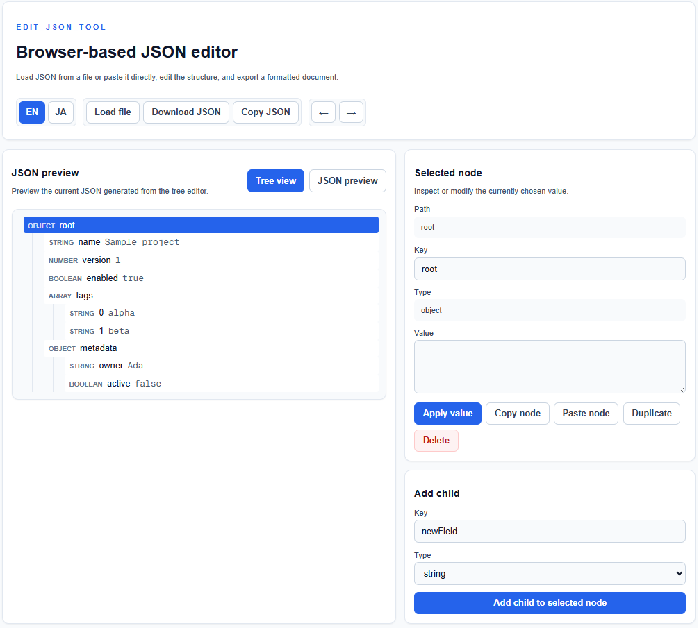

# edit_json_tool

[日本語 README](README.ja.md)

Browser-based JSON editor for loading, inspecting, editing, and exporting JSON files in a tree-oriented UI.



## Demo

https://rakima.github.io/edit_json_tool/

## Features

- Load a local `.json` file by file picker or drag and drop
- Edit JSON through a tree view instead of raw text
- Inspect and edit the selected node key, type, and value
- Add child values to objects and arrays
- Duplicate, delete, copy, and paste nodes
- Reorder sibling items with mouse drag and drop
- Undo and redo editor operations
- Preview the formatted JSON in a read-only JSON preview
- Download the edited JSON or copy it to the clipboard
- Switch the UI between English and Japanese

## Usage

1. Open the app in a browser.
2. Load a JSON file with `Load file`, or drop a `.json` file onto the editor area.
3. Select a node in `Tree view`.
4. Edit the selected node from the `Selected node` panel.
5. Use `Add child`, `Duplicate`, `Delete`, copy/paste, or drag and drop as needed.
6. Check the result in `JSON preview`.
7. Export the result with `Download JSON` or `Copy JSON`.

## Keyboard shortcuts

| Shortcut | Action |
| --- | --- |
| `Ctrl+N` | Start a new empty JSON object |
| `Ctrl+O` | Open the file picker |
| `Ctrl+S` | Download the current JSON |
| `Ctrl+C` | Copy the selected node when focus is not in an input |
| `Ctrl+V` | Paste the copied node when focus is not in an input |
| `Ctrl+Z` | Undo |
| `Ctrl+Y` | Redo |
| `Delete` | Delete the selected node |
| `F2` | Focus the selected node value editor |

## Development

```bash
npm install
npm run dev
```

Then open http://localhost:3000.

## Scripts

```bash
npm run dev
npm run build
npm run start
npm run lint
npx tsc --noEmit
npm run test:e2e
```

## Testing

The project uses Playwright for browser regression tests. The tests cover value editing, key validation, key rename undo, and drag reorder.

```bash
npm run test:e2e
```

If Playwright browsers are not installed yet:

```bash
npx playwright install chromium
```

## Relationship to the desktop version

`edit_json_tool_desktop` is the desktop reference implementation. This browser version follows the same tree-editing philosophy while keeping all work client-side in the browser.
